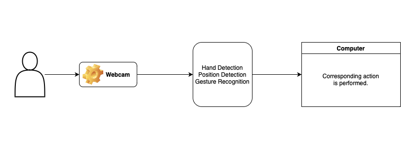

# Open Palm
Open Palm translates hand gestures into computer commands allowing for a touchless user interface.

*Mouse movement, click, and other gestures.*

## How it works

### Overview
1. Webcam (or iPhone camera through continuity camera!) is used for input.
2. Each frame is then processed and checked for 
    * hand presence (is there a hand in the frame?)
    * handedness (left or right)
    * position (only right hand -> for mouse movement)
    * gesture recognition (what gesture is being displayed?)
3. The recognized gestures are then mapped to certain computer commands.(click, scroll, etc.)

Comprehensive Explanation of Code

1. Camera Setup:
* The script initializes the camera using OpenCV (cv2) to capture the video feed.

2. Gesture Recognition Initialization:
* MediaPipe's hands module (mp.solutions.hands.Hands()) is employed to recognize hand landmarks in each frame.

3. Gesture Recognition Model Loading:
* A gesture recognition model is loaded from the specified path (MODEL_PATH) using MediaPipe's GestureRecognizer.

4. Frame Processing Loop:
* The script enters a continuous loop to process each frame from the camera feed.

5. Frame Preprocessing:
* Each frame is flipped horizontally for consistent orientation.
* The script defines a region of interest (ROI) on the frame where hand gestures are monitored.

6. Hand Landmark Detection:
* The hand landmarks within the ROI are detected using the MediaPipe hands module.
* The landmarks' positions are adjusted to match the coordinates of the ROI.

7. Mouse Movement Calculation:
If a right-handed gesture is recognized:
* The base of the palm is identified, and its position is used to determine the new mouse coordinates.
* The script calculates the new mouse position within a dead zone, ensuring small hand movements don't trigger mouse actions.
* The pyautogui library is then used to move the mouse to the new coordinates.

8. Gesture Recognition and Action Mapping:
* The MediaPipe hands module processes the hand landmarks and recognizes gestures asynchronously.
* Recognized gestures are mapped to specific actions (e.g., scrolling, clicking, or navigating tabs) based on the hand's position and the recognized gesture category.

9. Display Feedback:
* The script overlays real-time feedback on the camera feed, showing the ROI and a sub-rectangle for hand detection.
* Information about the current frames per second (FPS), handedness, recognized gesture, and its score is displayed on the camera feed.

10. Continuous Execution:
* The loop continues processing frames until the user interrupts by pressing 'q'.

Resource Cleanup:
* Upon completion, the script releases the camera resources and closes the MediaPipe hands instance.

**Currently supported actions:**
- click
- scroll up
- scroll down
- next tab 
- previous tab
- next desktop
- previous desktop
- close tab

### Features
- Deadzone, so minimal movements don't affect mouse position when trying to click something.

### Libraries Used
OpenCV, MediaPipe and PyAutoGui

